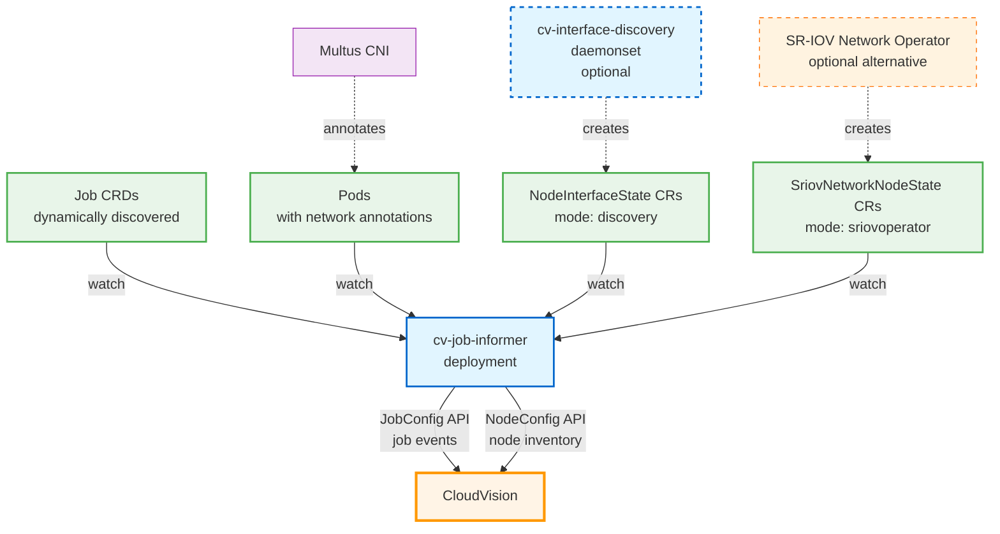
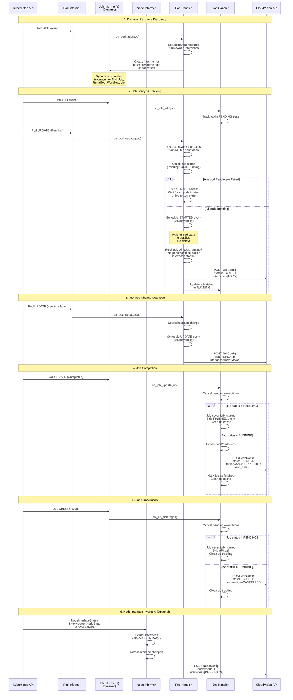

# CloudVision Kubernetes Job Integration

A Kubernetes integration that monitors jobs and reports job lifecycle events and network resource allocation to [Arista CloudVision](https://www.arista.com/en/products/eos/eos-cloudvision) to enable job-aware network troubleshooting.


## Architecture



## How It Works

The integration consists of two major components:

### **cv-job-informer (deployment) monitors jobs**
1. **Watches for Jobs**: Uses Kubernetes informer pattern with dynamic resource discovery based on pod's **ownerReferences** to watch any job type (TrainJob, PyTorchJob, MPIJob, etc.) in real-time
2. **Tracks Lifecycle**: Detects when jobs start and finish (or fail)
3. **Extracts Network Info**: Reads secondary network interface details from Multus CNI annotations (MAC addresses) on job pods. Only secondary interfaces are reported because primary interface (eth0) is not used for RDMA traffic in HPC jobs.
4. **Reports Job Events to CloudVision**: Sends job lifecycle changes to the JobConfig API with job metadata and network information
5. **Reports Node Interface Inventory to CloudVision**: Watches NodeInterfaceState CRs (from cv-interface-discovery daemonset) or SriovNetworkNodeState CRs (from SR-IOV Network Operator) and sends node-level interface inventory to the NodeConfig API

### **cv-interface-discovery (daemonSet) discovers interfaces**
1. **Discovers Node Interfaces**: Each daemonset pod discovers all physical network interfaces (SR-IOV and non-SR-IOV) on its node and creates/updates NodeInterfaceState custom resources

### **What gets reported to CloudVision API**
- Job ID and name (extracted from owner reference of pods)
- Location (configurable via `LOCATION` to differentiate between multiple clusters)
- Job start/finish timestamps
- Job state (RUNNING, COMPLETED, FAILED, CANCELLED)
- Node names OR interface MAC addresses for jobs (configurable via `JOBCONFIG_MODE`)
- Node-level interface inventory (interface name, IP and MAC addresses)

**JobConfig Mode - Resource Allocation Reporting**

The service extracts resource allocation info from pods and sends it to CloudVision API. Choose the mode based on your cluster setup:

| Mode | When to Use | What Gets Sent | Requirements |
|------|-------------|----------------|--------------|
| **`interface`** (default) | Nodes are shared between multiple jobs (each job uses specific interfaces) | List of interface MAC addresses from Multus CNI `network-status` annotation | Multus CNI (or equivalent) to attach secondary network interfaces |
| **`node`** | Each node is exclusively used by a single job (all interfaces on the node belong to the job) | List of node names from pod `spec.nodeName` | None - works with any Kubernetes cluster |

**How CloudVision Uses This Data:**
- **Interface mode**: Learns exact switch interfaces used by the job via MAC address correlation
- **Node mode**: Assumes all switch interfaces connected to the node are used by the job (learned via LLDP from nodes)

**NodeConfig Modes - Network Interface Discovery**

The CV Job Informer reports network interface inventory from each node to CloudVision for better network correlation. Choose the mode based on your cluster setup:

| Mode | Description | What Gets Deployed |
|------|-------------|-------------------|
| **`discovery`** (default) | Built-in interface discovery - discovers all physical interfaces (SR-IOV and non-SR-IOV) | NodeInterfaceState CRD + cv-interface-discovery DaemonSet |
| **`sriovoperator`** | Use existing SR-IOV Network Operator (SR-IOV interfaces only) | Nothing (watches existing SriovNetworkNodeState CRs) |
| **`disabled`** | No automatic discovery - you must call NodeConfig API separately with node interface inventory | Nothing |


## Quick Start

### Dependencies

- **Kubernetes cluster** >= 1.20
- **Job Operator** - Any job operator that creates pods with ownerReferences
- **[Multus CNI](https://github.com/k8snetworkplumbingwg/multus-cni)** - CNI meta‑plugin that attaches secondary network interfaces to pods for high-speed RDMA communications
  - Works with any RDMA NIC resource allocation mechanism: SR-IOV Device Plugin, DRA (Dynamic Resource Allocation), RDMA Shared Device Plugin with MACVLAN, etc.
  - **Required only when `JOBCONFIG_MODE=interface`** for reporting interface-level resource allocation
  - **Not required when `JOBCONFIG_MODE=node`** (reports node-level allocation instead)

### Deploy to Kubernetes

> **Note:** To obtain the `API_SERVER` and `API_TOKEN` for CloudVision API, refer to the [CloudVision API Guide](https://aristanetworks.github.io/cloudvision-apis/connecting).

All components are deployed to the `cloudvision` namespace by default. The deployment script will automatically create the namespace if it doesn't exist.

**Deployment requires a Docker registry** to distribute the image to cluster nodes. You can either use a pre-built public image or build and push your own.

#### Option 1: Use Pre-built Public Image (Quick Start)

Use the pre-built image from GitHub Container Registry (no build required):

```bash
make deploy \
  API_SERVER=www.arista.io \
  API_TOKEN=your-token-here \
  LOCATION=testlab \
  REGISTRY=ghcr.io/aristanetworks \
  IMAGE_TAG=latest \
  SKIP_BUILD=true
```

#### Option 2: Build and Push to Your Own Registry

For production use or customization, build and push to your own registry.

**Step 1: Authenticate with Docker Registry**

```bash
# For Docker Hub
docker login
# For private registry (e.g., Harbor, ECR, GCR, ACR)
docker login your-registry.io
```

**Step 2: Build, Push, and Deploy**

```bash
make deploy \
  API_SERVER=www.arista.io \
  API_TOKEN=your-token-here \
  JOBCONFIG_MODE=interface \
  NODECONFIG_MODE=discovery \
  LOCATION=testlab \
  REGISTRY=docker.io/your-username \
  PUSH=true \
  LOG_LEVEL=info
```

This will:
1. Build the Docker image locally
2. Push it to your registry (requires authentication from Step 1)
3. Deploy to Kubernetes with the registry image

**What gets created in your cluster:**

The deployment creates the following Kubernetes resources:

1. **Namespace**: `cloudvision` (created automatically if it doesn't exist)
2. **ServiceAccount**: `cv-job-informer` (in `cloudvision` namespace)
3. **ClusterRole**: `cv-job-informer` (cluster-wide permissions to watch jobs, pods, nodes, and node interface states)
4. **ClusterRoleBinding**: `cv-job-informer` (binds the ClusterRole to the ServiceAccount)
5. **Secret**: `cv-job-informer-api-credentials` (stores API server URL and authentication token)
6. **Deployment**: `cv-job-informer` (runs 1 replica on the control plane node)
7. **NodeInterfaceState CRD + cv-interface-discovery DaemonSet** (when `NODECONFIG_MODE=discovery`)

All resources are labeled with `app: cv-job-informer` for easy management and cleanup.

## Usage

```bash
> make help
CV Job Informer - Kubernetes Job Monitoring Service

Targets:
  delete          Delete cv-job-informer from Kubernetes
  deploy          Build and deploy to Kubernetes (requires API_SERVER, API_TOKEN, LOCATION)
  describe        Describe pod (COMPONENT=job for cv-job-informer, COMPONENT=node for cv-interface-discovery)
  help            Show this help message
  logs            View logs (COMPONENT=job for cv-job-informer, COMPONENT=node for cv-interface-discovery)
  restart         Restart component (COMPONENT=job for cv-job-informer, COMPONENT=node for cv-interface-discovery)
  status          Check status (COMPONENT=job for cv-job-informer, COMPONENT=node for cv-interface-discovery)

Variables:
  NAMESPACE          Namespace(s) to monitor (default: all namespaces)
                     - Empty = all namespaces cluster-wide
                     - Single namespace = watch only that namespace
                     - Comma-separated = watch all, filter to specified
                     Note: cv-job-informer pod is always deployed to 'cloudvision' namespace
  API_SERVER         API server address (REQUIRED)
                     See https://aristanetworks.github.io/cloudvision-apis/connecting for details
  API_TOKEN          API authentication token (REQUIRED)
                     See https://aristanetworks.github.io/cloudvision-apis/connecting for details
  LOCATION           Location identifier, e.g. cluster name (REQUIRED)
  JOBCONFIG_MODE     JobConfig mode: node or interface (default: interface)
                     See "JobConfig Mode - Resource Allocation Reporting" section for when to use each mode
  NODECONFIG_MODE    NodeConfig mode: discovery, sriovoperator, or disabled (default: discovery)
                     See "NodeConfig Modes - Network Interface Discovery" section for details on each mode
  NODE_INTERFACE_TYPE Node interfaces for NodeConfig: all, pf, or vf (default: all)
  LOG_LEVEL          Log level: debug, info, warning, error (default: info)
  REGISTRY           Container registry (e.g., docker.io/username)
  IMAGE_TAG          Docker image tag (default: latest)
  PUSH               Push image to registry: true or false (default: false)
  SKIP_BUILD         Skip building image, use existing: true or false (default: false)
  COMPONENT          Component to operate on: job or node (default: job)
                     - job = cv-job-informer deployment
                     - node = cv-interface-discovery daemonset
                     Used by: logs, status, restart, describe commands
```

## Implementation Details

<details>
<summary><span style="font-size: 1.5em; font-weight: bold;">Event Flow Diagram</span></summary>



</details>

<details>
<summary><span style="font-size: 1.5em; font-weight: bold;">How Job Informer Works</summary>

**What cv-job-informer monitors**

- **Job CRDs** (any type: TrainJob, PyTorchJob, MPIJob, etc.) - for job lifecycle events via dynamic resource discovery based on pod's ownerReferences
- **Pods** - for job resource allocation:
  - Node names (which nodes are running the job)
  - Network interface MAC addresses (from Multus CNI annotations)
- **NodeInterfaceState CRs** (when `NODECONFIG_MODE=discovery`) - for node-level interface inventory created by cv-interface-discovery daemonset
- **SriovNetworkNodeState CRs** (when `NODECONFIG_MODE=sriovoperator`) - for node-level SR-IOV interface inventory created by [SR-IOV Network Operator](https://github.com/k8snetworkplumbingwg/sriov-network-operator)

**Supported Job Resource Types:**

Only the following resource types are monitored (whitelist approach). This ensures the informer only watches resources it has RBAC permissions for:

| API Group | Kind | Description |
|-----------|------|-------------|
| `batch` | `Job` | Kubernetes batch Jobs (also used by JobSet) |
| `kubeflow.org` | `PyTorchJob`, `TFJob`, `MPIJob`, `XGBoostJob`, `PaddleJob` | Kubeflow Training Operator |
| `trainer.kubeflow.org` | `TrainJob` | Kubeflow Trainer v2 |
| `argoproj.io` | `Workflow`, `WorkflowTemplate`, `CronWorkflow` | Argo Workflows |
| `run.ai` | `RunaiJob` | Run:ai v1 API |
| `run.ai` | `TrainingWorkload`, `InferenceWorkload`, `InteractiveWorkload` | Run:ai v2 API |
| `batch.volcano.sh` | `Job` | Volcano batch scheduler |
| `ray.io` | `RayJob`, `RayCluster` | KubeRay |

**Adding Support for New Resource Types:**

To monitor additional job resource types:

1. **Add RBAC permissions** in `job_informer.yaml`:
   ```yaml
   - apiGroups: ["your-api-group.io"]
     resources: ["yourjobs"]
     verbs: ["get", "list", "watch"]
   ```

2. **Add to whitelist** in `constants.py`:
   ```python
   SUPPORTED_JOB_RESOURCES = {
       # ... existing entries ...
       ("your-api-group.io", "YourJob"),
   }
   ```

3. **Redeploy** the cv-job-informer

**How Resource Allocation is Extracted:**

The service extracts resource allocation information from pods to send to CloudVision API:

- **Node names** (always available)
  - Extracted from pod `spec.nodeName` field
  - Sent when `JOBCONFIG_MODE=node`
  - Works in all Kubernetes clusters

- **Interface addresses** (requires [Multus CNI](https://github.com/k8snetworkplumbingwg/multus-cni))
  - Extracted from `k8s.v1.cni.cncf.io/network-status` annotation added by Multus CNI
  - MAC addresses of secondary interfaces (net1, net2, etc.) are sent when `JOBCONFIG_MODE=interface`
  - Works with any secondary network attachment (SR-IOV, DRA, Macvlan, etc.)

- **RDMA device info** (for logging only, requires [SR-IOV Network Device Plugin](https://github.com/k8snetworkplumbingwg/sriov-network-device-plugin))
  - Added to network-status annotation by SR-IOV Network Device Plugin
  - Provides device name and PCI address for debugging logs

**What it needs:**
- Read-only access to pods, nodes, and job CRDs (via RBAC)
- Network access to CloudVision API
- CloudVision API credentials (stored in Kubernetes secret)

</details>

<details>
<summary><span style="font-size: 1.5em; font-weight: bold;">How Interface Discovery Works</summary>

The cv-interface-discovery daemonset runs one pod on each node to discover network interfaces. Here's how it retrieves interface information:

1. **Enumerate Network Interfaces**: Scans `/sys/class/net/` to find all network devices on the node
2. **Filter Physical Interfaces**: Identifies physical interfaces by checking for a `device` symlink pointing to the PCI device (excludes virtual interfaces like bridges, bonds, veth pairs which don't have this symlink)
3. **Detect SR-IOV Hierarchy**:
   - Reads `/sys/class/net/<interface>/device/sriov_numvfs` to identify SR-IOV Physical Functions (PFs)
   - Reads `/sys/class/net/<interface>/device/virtfn*` symlinks to enumerate all configured VFs (stable, always present)
   - Reads `/sys/class/net/<interface>/device/physfn` to identify Virtual Functions (VFs) and their parent PF
   - Maps VF-to-PF relationships
4. **Extract MAC Addresses**: Reads `/sys/class/net/<interface>/address` for each interface's MAC address
5. **Extract IP Addresses**: Uses socket ioctl (SIOCGIFADDR) to get IPv4 addresses for interfaces that are in "up" state
6. **Collect Metadata**: Gathers interface names, types (PF/VF/regular), PCI device information, and RDMA device names (if available)
7. **VF Caching for Stability**: Maintains an in-memory cache of VF details (name, MAC, IP, RDMA) keyed by PCI address
   - When VFs are visible in host namespace: reads current details and updates cache
   - When VFs are moved to pod namespaces (during job execution): uses cached details
   - This ensures stable VF reporting and avoids unnecessary NodeConfig updates when jobs start/stop
8. **Create NodeInterfaceState CR**: Stores all discovered interface data in a custom resource named after the node

**What Gets Stored in NodeInterfaceState CR:**
- List of all physical network interfaces with their MAC addresses and IP addresses
- SR-IOV PF/VF hierarchy (which VFs belong to which PF)
- Interface types and names
- RDMA device names (for RDMA-capable interfaces)
- VF details remain stable even when VFs are allocated to pods (using cached information)
- Owner reference to the Node object (ensures automatic CR deletion when node is removed)

**How cv-job-informer Uses It:**
- Watches all NodeInterfaceState CRs cluster-wide
- When a CR is created/updated, extracts the interface inventory and sends to CloudVision NodeConfig API
- When a CR is deleted (e.g., node removed from cluster), deletes the NodeConfig from CloudVision

**Alternative (NODECONFIG_MODE=sriovoperator):** When SR-IOV Network Operator is already deployed, it creates SriovNetworkNodeState CRs with similar information. cv-job-informer watches those instead, and cv-interface-discovery is not deployed.

</details>

<details>
<summary><span style="font-size: 1.5em; font-weight: bold;">Example API Payloads Sent to CloudVision</span></summary>

#### JobConfig API - Job Started (JOBCONFIG_MODE=interface)

```json
{
  "key": {
    "id": "a1b2c3d4-e5f6-7890-abcd-ef1234567890"
  },
  "location": "cluster-west",
  "job_name": "gpt-fine-tuning",
  "state": "JOB_STATE_RUNNING",
  "start_time": "2025-12-05T10:30:00Z",
  "interfaces": {
    "values": [
      "aa:bb:cc:dd:ee:01",
      "aa:bb:cc:dd:ee:02",
      "aa:bb:cc:dd:ee:03",
      "aa:bb:cc:dd:ee:04"
    ]
  }
}
```

#### JobConfig API - Job Finished (JOBCONFIG_MODE=node)

```json
{
  "key": {
    "id": "a1b2c3d4-e5f6-7890-abcd-ef1234567890"
  },
  "location": "cluster-west",
  "job_name": "gpt-fine-tuning",
  "state": "JOB_STATE_FINISHED",
  "start_time": "2025-12-05T10:30:00Z",
  "end_time": "2025-12-05T12:45:30Z",
  "nodes": {
    "values": [
      "gpu-node-1",
      "gpu-node-2",
      "gpu-node-3",
      "gpu-node-4"
    ]
  }
}
```

#### NodeConfig API - Node Interface Inventory

Sent when `NODECONFIG_MODE=discovery` or `NODECONFIG_MODE=sriovoperator`:

```json
{
  "key": {
    "node_name": "gpu-node-1"
  },
  "location": "cluster-west",
  "interfaces": [
    {
      "name": "ens1f0v0",
      "mac": "aa:bb:cc:dd:ee:01",
      "ip": "192.168.1.11"
    },
    {
      "name": "ens1f0v1",
      "mac": "aa:bb:cc:dd:ee:02",
      "ip": "192.168.1.12"
    }
  ]
}
```

**Privacy Notes:**
- ✅ No user data, code, or training data is sent
- ✅ No pod logs or container output is sent
- ✅ No environment variables or secrets are sent
- ✅ Only job metadata and basic node interface info are sent
- ✅ Runs in your cluster (no external dependencies except CloudVision API)

</details>

## Tenant Scheduler Integration (Alternative Use Case)

<details>
<summary><b>Click to expand</b></summary>

> **Note:** This section describes an alternative use case for GPU-as-a-Service cloud providers integrating tenant schedulers with CloudVision. This is separate from the regular Kubernetes job monitoring described above.

The `send_jobconfig()` API utility function in `api_utils.py` supports a tenant mode (`isTenantJob=True`) for reporting tenant allocations to CloudVision. Tenant allocations appear on the **CloudVision Tenant Dashboard** (separate from the regular Job Dashboard).

**Use Case:**
- GPU-as-a-Service providers with multi-tenant schedulers
- Track which network resources are allocated to each tenant
- Correlate network issues to specific tenant workloads

**How It Works:**

Tenant schedulers must call `send_jobconfig()` directly at these lifecycle points:

1. **Tenant Allocation**: Call with `job_state='JOB_STATE_RUNNING'` and `isTenantJob=True`
2. **Resource Change**: Call with updated `nodes` or `interfaces` when tenant resources scale
3. **Tenant Deallocation**: Call with `job_state='JOB_STATE_COMPLETED'` and `isTenantJob=True`

**Example Integration:**

```python
from api_utils import send_jobconfig

# When tenant is allocated resources
send_jobconfig(
    api_server="www.arista.io",
    api_token="your-api-token",
    job_id="tenant-unique-id",
    job_name="tenant-abc",
    location="us-west-cluster",
    job_state="JOB_STATE_RUNNING",
    nodes=["gpu-node-1", "gpu-node-2"],
    start_time="2025-12-05T10:30:00Z",
    jobconfig_mode="node",
    isTenantJob=True
)

# When tenant allocation ends
send_jobconfig(
    api_server="www.arista.io",
    api_token="your-api-token",
    job_id="tenant-unique-id",
    job_name="tenant-abc",
    location="us-west-cluster",
    job_state="JOB_STATE_COMPLETED",
    nodes=["gpu-node-1", "gpu-node-2"],
    start_time="2025-12-05T10:30:00Z",
    end_time="2025-12-06T18:00:00Z",
    jobconfig_mode="node",
    isTenantJob=True
)
```

</details>

## ⚠️ Disclaimer

> This repository provides **reference implementations** for integrating HPC job workloads with CloudVision. It is intended as a starting point for users to adapt and customize for their specific environments.
>
> **This is not a fully supported Arista product.** Users are responsible for reviewing, testing, and modifying this code to meet their security and operational requirements. By using this code, you acknowledge it is provided as-is for reference purposes.
